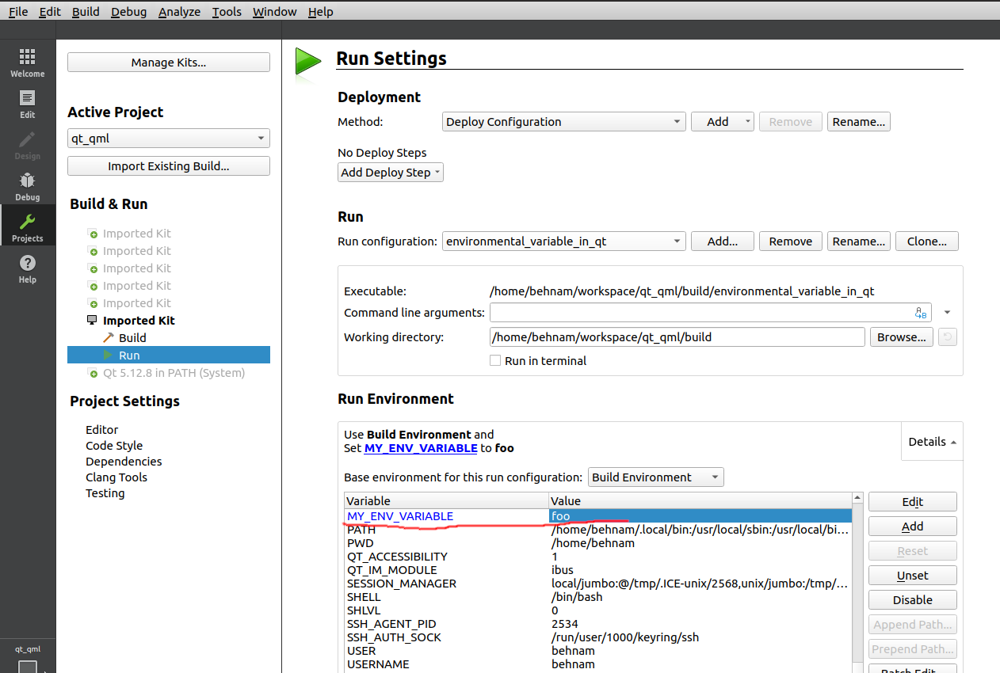

In Qt, you can access environment variables using the `QProcessEnvironment` class, which provides a platform-independent way to access environment variables. Alternatively, you can use the `qgetenv()` function for a more direct approach. Here's how you can use both methods:

### Using `QProcessEnvironment`

1. **Include QProcessEnvironment**: First, include the `QProcessEnvironment` header in your code:

   ```cpp
   #include <QProcessEnvironment>
   ```

2. **Get the Current Environment**: Then, get the current process environment:

   ```cpp
   QProcessEnvironment env = QProcessEnvironment::systemEnvironment();
   ```

3. **Access an Environment Variable**: Now, you can access a specific environment variable using the `value()` method:

   ```cpp
   QString value = env.value("MY_ENV_VARIABLE");
   ```

   Replace `"MY_ENV_VARIABLE"` with the name of the environment variable you want to access.

### Using `qgetenv()`

1. **Include Header**: Include the necessary header:

   ```cpp
   #include <QByteArray>
   ```

2. **Retrieve the Variable**: Use `qgetenv()` to get the value of the environment variable:

   ```cpp
   QByteArray value = qgetenv("MY_ENV_VARIABLE");
   ```

   Again, replace `"MY_ENV_VARIABLE"` with the name of your environment variable.

3. **Convert to QString (Optional)**: If you need the environment variable as a `QString`, convert the `QByteArray`:

   ```cpp
   QString valueStr = QString::fromUtf8(value);
   ```

### Choosing the Method

- **`QProcessEnvironment`**: This class is more suitable if you need to work with multiple environment variables, as it allows you to manipulate a copy of the environment.
- **`qgetenv()`**: For simply retrieving a single environment variable, `qgetenv()` is more straightforward and efficient.

### Error Handling

- Both methods will return an empty string or `QByteArray` if the environment variable is not set. Always check for this condition to handle missing or unset variables gracefully.

### Example

Here's a simple example that demonstrates retrieving an environment variable using `qgetenv()`:

```cpp
#include <QCoreApplication>
#include <QByteArray>
#include <QDebug>

int main(int argc, char *argv[]) {
    QCoreApplication app(argc, argv);

    QByteArray value = qgetenv("MY_ENV_VARIABLE");
    if (!value.isEmpty()) {
        qDebug() << "Value of MY_ENV_VARIABLE:" << value;
    } else {
        qDebug() << "MY_ENV_VARIABLE is not set.";
    }

    return app.exec();
}
```

```
export MY_ENV_VARIABLE=foo
```


This example will print the value of `MY_ENV_VARIABLE` if it's set, or a message indicating it's not set. Remember to replace `"MY_ENV_VARIABLE"` with the actual name of the environment variable you want to access.





