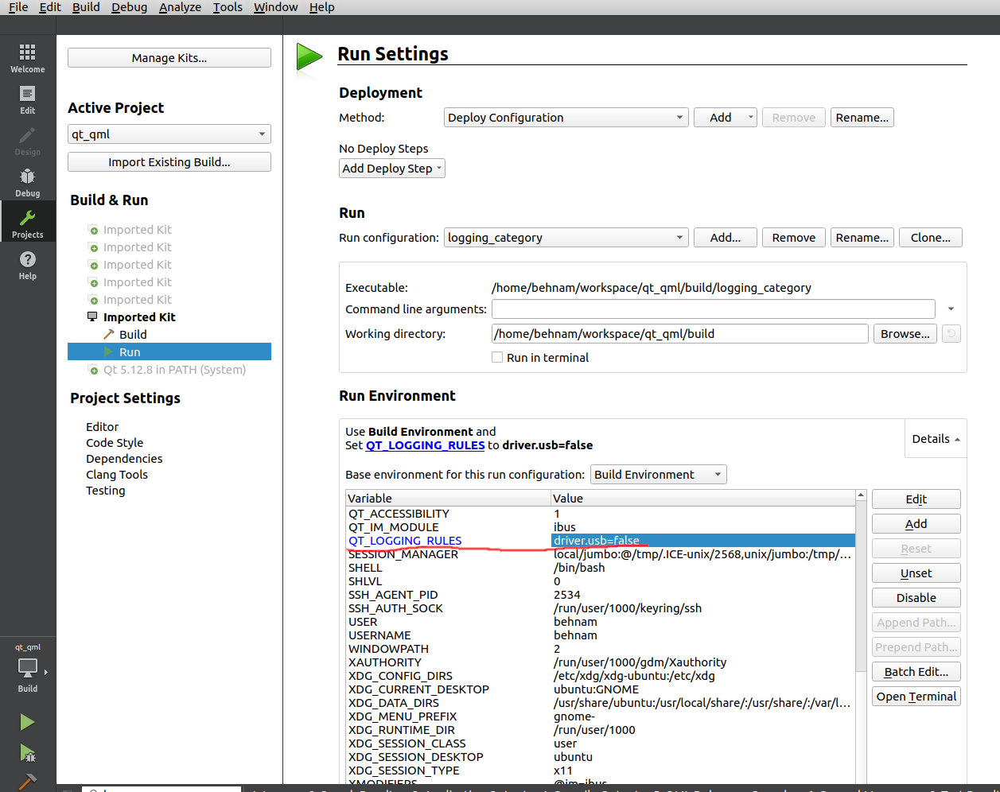

# QLoggingCategory

To create a category for logging, use the followings:
```cpp
// in a header
Q_DECLARE_LOGGING_CATEGORY(driverUsb)

// in one source file
Q_LOGGING_CATEGORY(driverUsb, "driver.usb")
```

1. `Q_DECLARE_LOGGING_CATEGORY(driverUsb)`: 
   - This macro is used in a header file to declare a logging category. 
   - It does not create or define the logging category, but merely declares it so that it can be used in different source files. 
   - This is similar to declaring a function or a variable in a header file - it tells the compiler that this logging category exists and will be defined somewhere else.
   - It is typically placed in a header file that is included wherever the logging category needs to be used.

2. `Q_LOGGING_CATEGORY(driverUsb, "driver.usb")`: 
   - This macro is used in a source file to define and initialize the logging category. 
   - It associates the category name `driverUsb` with a string identifier, in this case, `"driver.usb"`. This string identifier is used in the logging output to easily identify messages belonging to this category.
   - This macro is generally used once in one source file to define the logging category that has been declared with `Q_DECLARE_LOGGING_CATEGORY`.
   - It actually creates the logging category and sets it up for use in logging statements.

To print logs in Qt with a timestamp and category:

```cpp
qSetMessagePattern("[%{time yyyy-MM-dd hh:mm:ss.zzz}] [%{type}] [%{category}] %{message}");
```

Now you can have 
```cpp
qDebug() << "Debug message";
```


```cpp
qCCritical(driverUsb) << "Critical message from driverUsb";
```

and the output is:


```
[2023-11-13 21:43:50.059] [debug] [default] Debug message
[2023-11-13 21:43:50.059] [critical] [driver.usb] Critical message from driverUsb
```

In Qt, you can control the logging output of specific categories using environment variables. To enable or disable the `driverUsb` logging category, you would set the `QT_LOGGING_RULES` environment variable. 

Here's how you can do it:

1. **To Enable the `driverUsb` Category:**
   - Set `QT_LOGGING_RULES="driver.usb=true"`. This will enable logging for the `driverUsb` category.

2. **To Disable the `driverUsb` Category:**
   - Set `QT_LOGGING_RULES="driver.usb=false"`. This will disable logging for the `driverUsb` category.

You can set these environment variables in different ways depending on your operating system and development environment:

- **On Windows:**
  - In a command prompt, you can set an environment variable for the session by using `set QT_LOGGING_RULES=driver.usb=true`.
  - For a more permanent setting, you can set it through the System Properties -> Environment Variables.

- **On Unix/Linux/MacOS:**
  - In a terminal, use `export QT_LOGGING_RULES='driver.usb=true'` to set it for the current session.
  - To make it permanent, you can add the export command to your shell's profile script (like `~/.bashrc` or `~/.bash_profile`).

- **In Qt Creator:**
  - Go to the "Projects" tab, select your project and build configuration.
  - Under the "Run" section, you can set environment variables for your application. Add `QT_LOGGING_RULES` with the appropriate value (`driver.usb=true` or `driver.usb=false`).




or you can use regular expression:


```cpp
export QT_LOGGING_RULES="*.debug=false;driver.usb=false"
```


Refs: [1](https://doc.qt.io/qt-6/qloggingcategory.html)
