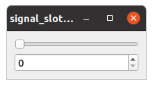
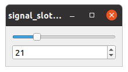

- [Signal and Slot](#signal-and-slot)
  * [Signal Slot Syntax](#signal-slot-syntax)
    + [Old syntax](#old-syntax)
    + [New syntax](#new-syntax)
  * [Connecting to a Function](#connecting-to-a-function)
  * [Connecting to a Lambda](#connecting-to-a-lambda)
  * [QWidget Signal and Slot](#qwidget-signal-and-slot)
  * [QML Signal and Slot](#qml-signal-and-slot)
  * [Create a Signal Slot Connection in QML File](#create-a-signal-slot-connection-in-qml-file)
  * [Where to connect/ disconnect signals to/ from slots](#where-to-connect--disconnect-signals-to--from-slots)

# Signal and Slot
A signal is emitted when a particular event occurs, Signals are emitted by an
object when its internal state has changed in some way. Qt's widgets have many
predefined signals, but we can always subclass widgets to add our own signal


A slot is a function that is called in response to a particular signal. Qt's
widgets have many pre-defined slots

The signature of a **signal** must match the signature of the **receiving slot**

A class which emits a signal neither knows nor cares which slots receive the signal.

All classes that inherit from `QObject` or one of its sub-classes (e.g., `QWidget`)
can contain signals and slots.

Signals are automatically generated by the moc (Meta-Object Compiler ) and must
not be implemented in the .cpp file. They can never have return types (i.e. use void).

```cpp
class Counter: public QObject
{
    Q_OBJECT
public:
    Counter() { m_value = 0; }

    int value() const { return m_value; }
    void setValue(int value);

public slots:
    void valueNotification();

signals:
    void valueChanged(int newValue);

private:
    int m_value;
};
```
now in the main:

```cpp

Counter a, b;
QObject::connect(&a, &Counter::valueChanged, &b, &Counter::valueNotification);

a.setValue(2);
std::cout << b.value() << std::endl;
}
```

[source](../src/signal_slot_lambda.cpp)


As on other example:

```cpp
class mytimer : public QObject
{
    Q_OBJECT
public:
    explicit mytimer(QObject *parent = nullptr);

private slots:
    void addOneSecond();


signals:
    void mySignal(int value); //emit mySignal(value)

};
```
Now in the cpp file:


```cpp
mytimer::mytimer(QObject *parent) : QObject(parent)
{
    QTimer *timer=new QTimer(this);
    connect(timer, &QTimer::timeout,this, &mytimer::addOneSecond);
    timer->start(1000);
}

void mytimer::addOneSecond()
{
    qDebug()<<QString::fromStdString( ( "foo") );
}
```

[source](../src/signal_slot_mytimer.cpp)


## Signal Slot Syntax

### Old syntax 

This is old string-based syntax which is NOT recommended, for instance::

```cpp
QObject::connect(&a, SIGNAL( valueChanged( int) ), &b, SLOT( valueNotification() ));
```
or 

```cpp
QObject::connect(&manager, SIGNAL(finished(QNetworkReply *)), &loop,SLOT(quit()));
```


### New syntax

```cpp
connect(sender, &Sender::valueChanged, receiver, &Receiver::updateValue);
```


## Connecting to a Function

```cpp
connect( sender, &Sender::valueChanged,  someFunction );
```
using bind:

```cpp
connect(sender, &Sender::valueChanged,  std::bind( &Receiver::updateValue, receiver, "senderValue", std::placeholders::_1 ));
```

## Connecting to a Lambda

```cpp
QObject::connect(&a, &Counter::valueChanged, [=](int newValue) {
    QMessageBox msgBox;
    msgBox.setText(QString::number(newValue));
    msgBox.exec();
  });
```
[source](../src/signal_slot_lambda.cpp)

Refs: [1](https://wiki.qt.io/New_Signal_Slot_Syntax)


## QWidget Signal and Slot 

```cpp
QApplication app( argc, argv );
QWidget *window=new QWidget();

QSlider *slider=new QSlider(Qt::Horizontal);
QSpinBox *spinbox=new QSpinBox();

QObject::connect(slider,&QSlider::valueChanged,spinbox, &QSpinBox::setValue);

auto layout = new QVBoxLayout(window);
layout->addWidget(slider);
layout->addWidget(spinbox);
```




<br/>
<br/>




[source](../src/signal_slot_widget.cpp)

## QML Signal and Slot 


```cpp
class User : public QObject
{
    Q_OBJECT
    Q_PROPERTY(QString name READ getName WRITE setName NOTIFY nameChanged)
    Q_PROPERTY(Role role READ getRole WRITE setRole NOTIFY roleChanged)


public:
    //explicit User(QObject *parent = nullptr);
    enum Role{Dev, Manager, Tester, Fullstack};
    Q_ENUM(Role);
    User(const QString & name, int age, Role role ,QObject *parent = nullptr );

    QString getName() const;
    void setName(const QString &name);
signals:
    void nameChanged();
    void roleChanged();

public slots:
    void changeRole();

private:
    QString m_name;
    Role m_role;
};
```

in the cpp file:

```cpp
void User::setRole(Role role)
{
    if(m_role==role)
        return;
    m_role=role;
    emit roleChanged();
}

void User::changeRole()
{
    setRole(m_role == User::Dev ? User::Manager  : User::Dev);
}
```

Now in the qml file:

```
import QtQuick 2.12

Rectangle {
    width: 600
    height: 800
    Column {
        anchors.centerIn: parent
        spacing: 10
        Text {
            text: _currentuser.name
        }
    }
}
```
and in the main application:

```cpp
  QGuiApplication app(argc, argv);
  QQuickView view;

  User *currentuser = new User("foo", 10, User::Dev);
  QQmlContext *context = view.rootContext();
  context->setContextProperty("_currentuser", currentuser);
  view.setSource(QUrl("qrc:/qml/signal_slot.qml"));
  view.show();

  QTimer *timer = new QTimer(&app);
  timer->start(1000);

  QObject::connect(timer, &QTimer::timeout, currentuser, &User::changeRole);
  return app.exec();
```

Now every second, we call `User::changeRole` which will call `setRole(m_role == User::Dev ? User::Manager  : User::Dev)` which will `emit roleChanged();`, since in the class we have such a property `Q_PROPERTY(Role role READ getRole WRITE setRole NOTIFY roleChanged)`
and in the qml side we have:

```
Text 
{
    text: _currentuser.role
}
```
The form get automatically updated. 

## Create a Signal Slot Connection in QML File

To connect a signal to slot in the QML file:

```
qml-element {
    id: qml-element-id
    Connections {
        target: <target-name> // coming from context->setContextProperty("target-name", &object);
        function on<Signal-name>(params) //in the cpp side  signals:  void output(QString data);
        {
            another-qml-element-id.text = params
        }
    }
}
```

for example:

```
Label {
    id: pingResult
    Connections {
        target: _pinger
        function onOutput(message) {
            pingResult.text = message
        }
    }
}
```
[source](../src/pinger_qprocess.cpp)


## Where to connect/ disconnect signals to/ from slots


