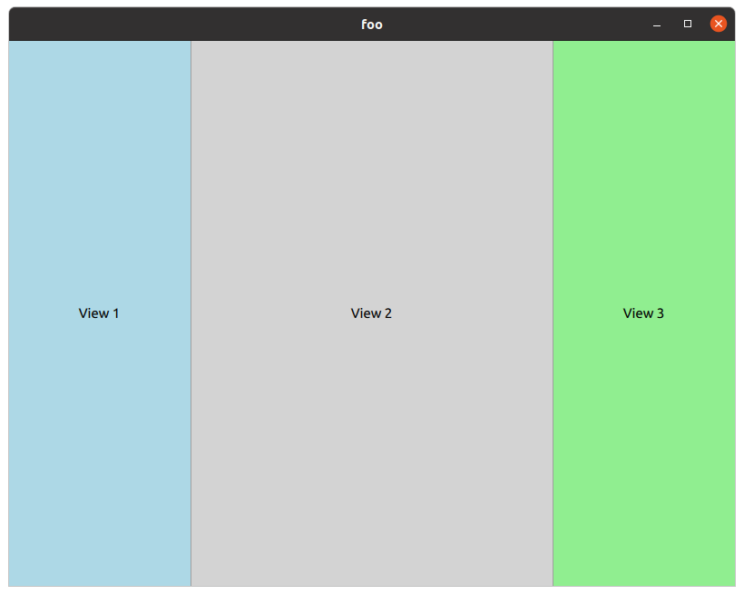

# SplitView

```
import QtQuick 2.12
import QtQuick.Window 2.12
import QtQuick.Layouts 1.12
import QtQuick.Controls 1.4

ApplicationWindow
{
    width: 800
    height: 600
    visible: true
    title: qsTr("foo")

SplitView {
    anchors.fill: parent
    orientation: Qt.Horizontal

    Rectangle {
        width: 200
        Layout.maximumWidth: 400
        color: "lightblue"
        Text {
            text: "View 1"
            anchors.centerIn: parent
        }
    }
    Rectangle {
        id: centerItem
        Layout.minimumWidth: 50
        Layout.fillWidth: true
        color: "lightgray"
        Text {
            text: "View 2"
            anchors.centerIn: parent
        }
    }
    Rectangle {
        width: 200
        color: "lightgreen"
        Text {
            text: "View 3"
            anchors.centerIn: parent
        }
    }
}

}
```




Refs: [1](https://doc.qt.io/qt-6/qml-qtquick-controls2-splitview.html)
